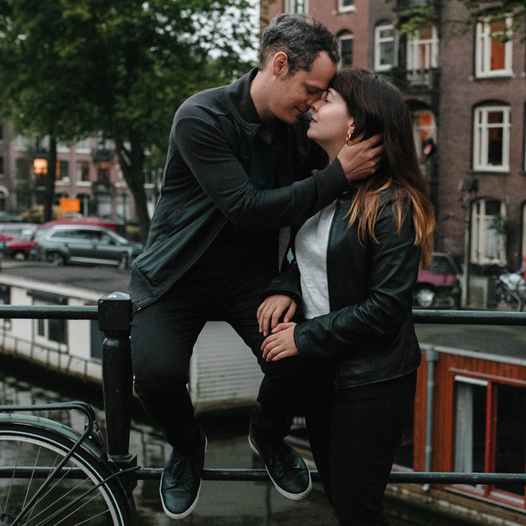

#### [Anca & Rik wedding](./)  &nbsp; : &nbsp; [RSVP](https://forms.gle/uzLpqn1FvGNjH6sW7)  &nbsp; &#10209; &nbsp;   [Travel](travel.html)  &nbsp; &#10209; &nbsp;  [Hotels](hotels.html)  &nbsp; &#10209; &nbsp;  [Events](events.html)  &nbsp; &#10209; &nbsp;  [Visit Transylvania](trip.html)

***

<figure style="float: right; margin-left: 80px; margin-bottom: 20px; margin-top: 20px">

<figcaption style="text-align: center; margin-top: 5px; color: gray;">&#9400; [TreeArcade](https://www.treearcade.com/)</figcaption>
</figure>

## Anca & Rik

### 30 July 2022 ❤️ Bistrița, Romania

[🇬🇧](./) &nbsp; [🇮🇸](is/index.html)

After 2 years of waiting, it's finally happening - we are getting married on 30 July 2022! And we want you to be a part of it!  &#x1F600;

The event will take place in Anca's hometown of [Bistrița, Romania](https://en.wikipedia.org/wiki/Bistri%C8%9Ba). The tentative schedule is:

* **July 30** : church wedding & wedding party at [Hotel Metropolis](https://www.google.com/maps/place/Metropolis/@47.1272607,24.4966106,15z/data=!4m2!3m1!1s0x0:0x250b9cd755c23bf0?sa=X&ved=2ahUKEwjY_927vZnmAhUMUlAKHa9MDzgQ_BIwFHoECBoQCA), Bistrița

* **July 31** : after-party TBD

Please note that, since it may take some time to reach our wedding venue, we recommend you **reserve Friday July 29 for travelling purposes**.

Will you join us for our big celebration? Please **[RSVP here](https://forms.gle/uzLpqn1FvGNjH6sW7)** ! And don't hesitate to email us ([Anca](mailto:anca.dmtrch@gmail.com) or [Rik](mailto:rikkid6@gmail.com)) with any of your questions.

***

**Contact:** [Anca](mailto:anca.dmtrch@gmail.com) & [Rik](mailto:rikkid6@gmail.com).

