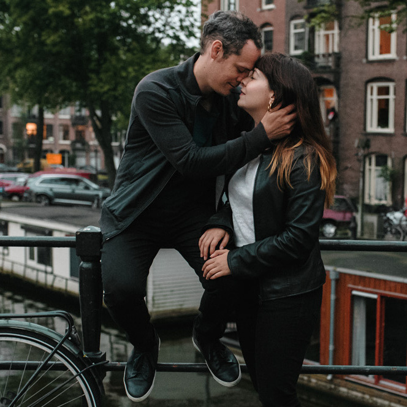

#### [Anca & Rik wedding](./)  &nbsp; : &nbsp; [RSVP](https://forms.gle/nrNsmtP1qeaxgmD89)  &nbsp; &#10209; &nbsp;   [Travel](travel.html)  &nbsp; &#10209; &nbsp;  [Hotels](hotels)  &nbsp; &#10209; &nbsp;  [Post-wedding trip](trip) 

***

<figure style="float: right; margin-left: 80px; margin-bottom: 20px; margin-top: 20px">

<figcaption style="text-align: center; margin-top: 5px; color: gray;">&#9400; [TreeArcade](https://www.treearcade.com/)</figcaption>
</figure>

## Travel
### Anca & Rik: 18 July 2020 ❤️ Bistrița, Romania

The wedding will take place at **[Hotel Metropolis](https://www.google.com/maps/place/Metropolis/@47.1272607,24.4966106,15z/data=!4m2!3m1!1s0x0:0x250b9cd755c23bf0?sa=X&ved=2ahUKEwjY_927vZnmAhUMUlAKHa9MDzgQ_BIwFHoECBoQCA)**, in Anca's hometown of **[Bistrița, Romania](https://en.wikipedia.org/wiki/Bistri%C8%9Ba)**. Bistrița is located in the North part of Romania, in the region of [Transylvania](https://en.wikipedia.org/wiki/Transylvania).

Please note that, since it may take some time to reach our wedding venue, we recommend you **reserve Friday July 17 for travelling purposes**.

### Airports

The closest airport to Bistrița is **[Avram Iancu Cluj International Airport](http://airportcluj.ro/?id_limba=2)**. To get to Bistrița from Cluj, it takes an additional 2 hour drive (around 100km).

Other airports close to Bistrița are:

* [Transilvania International Airport](https://www.aeroportultransilvania.ro/en/), Târgu Mureș, Romania (107km)
* [Satu Mare International Airport](https://www.aeroportulsatumare.ro/), Romania (195km)
* [Ștefan cel Mare International Airport](https://www.aeroportsuceava.ro/en/), Suceava, Romania (207km)
* [Henri Coandă International Airport](http://www.bucharestairports.ro/en), Bucharest, Romania (410km)
* [Budapest International Airport](https://www.bud.hu/en), Hungary (487km) **This airport is in a different country, you will need to pass through border control when driving from Hungary to Romania.**

### Airlines

**[WizzAir](https://wizzair.com/en-gb#/)** and **[Blue Air](https://www.blueairweb.com/en/gb/)** (the 2 most popular low cost airlines in Romania) are **NOT indexed by popular flight aggregators** (e.g. SkyScanner). To view available flights, you need to check the airline websites.

### From the airport to Bistrița

The easiest way to reach Bistrița from the airport is by **renting a car**.

If you would prefer not to drive, let us know in advance, and we will help you with arranging transportation, either through public transit, or through hiring a private mini-van, if there are enough people traveling from the same airport as you.

### Visa

Romania is part of the European Union, but NOT a part of the Schengen customs union. **If you are not a citizen of the EU / EEA, you might need a tourist visa to enter the country**. [Here](https://www.mae.ro/sites/default/files/file/anul_2019/2019_pdf/anexa_1_en.pdf) is a complete list of countries whose citizens require a tourist visa to enter Romania. More info about the Romanian visa application process can be found [here](https://www.mae.ro/en/node/18909).

***

**Contact:** [Anca](mailto:anca.dmtrch@gmail.com) & [Rik](mailto:rikkid6@gmail.com).
